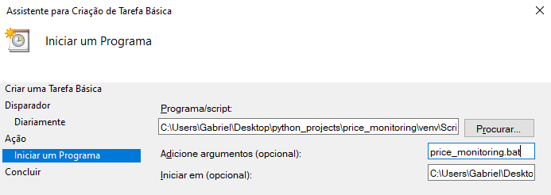

# Monitoramento de Preço

## Descrição

Projeto de monitoramento de preços de produtos por meio de web scraping de diferentes e-commerces, com dashboard para visualização histórico de preços.

### Funcionalidades
- Identificação do menor preço disponível à vista em cinco e-commerces (Kabum, Amazon, Mercado Livre, Terabyte e Pichau) para cada produto
- Aplicativo web para visualização do histórico de preço, com opção de filtragem por produto e intervalo de meses
- Armazenamento dos dados de preço e título da oferta, data e loja em arquivos CSV separados por produto


## Instalação

É necessário ter Python instalado, preferencialmente a versão 3.11 (ou mais recente) na qual este projeto foi desenvolvido.

Clone o repositório na pasta que preferir do seu computador:

```
git clone https://github.com/Gabriel-c-oliveira/price_monitoring.git
```

Em seguida, com a pasta raiz do projeto aberta no terminal, instale as bibliotecas necessárias com o comando:

```
pip install requirements.txt
```

## Uso

Abra o arquivo `config/browser.yaml` e defina o navegador que será usado para a raspagem de dados. Estão disponíveis Chrome e Edge. Inclua também o seu user-agent, que você pode conferir facilmente pesquisando "my user-agent" no Google.

```
# browser.yaml - exemplo
browser: 'edge'

user_agent: 'Mozilla/5.0 (Windows NT 10.0; Win64; x64) AppleWebKit/537.36 (KHTML, like Gecko) Chrome/122.0.0.0 Safari/537.36 Edg/122.0.0.0'
```

Insira no arquivo `config/tracked_products.yaml` as informações de cada produto que deseja monitorar: nome para identificação, palavras-chaves para selecionar somente os anúncios que as contenham, e URLs resultantes da busca pelo produto em diferentes sites onde ocorrerá a coleta de dados.

```
# tracked_products.yaml - exemplo
- name: 'RTX 4070 12GB'
  keywords:
    - 'rtx'
    - '4070'
    - '12
  url_kabum: 'https://www.kabum.com.br/hardware/placa-de-video-vga/placa-de-video-nvidia?page_number=1&page_size=20&facet_filters=eyJHZUZvcmNlIFJUWCBTw6lyaWUgNDAiOlsiUlRYIDQwNzAiXX0=&sort=-number_ratings'
  url_mercado_livre: 'https://lista.mercadolivre.com.br/informatica/componentes-pc/placas/placas-video/rtx-4070-12gb_NoIndex_True#D[A:rtx%204070%2012gb,L:undefined,on]'
```

Para automatizar o monitoramento, será apresentada uma solução utilizando arquivos batch e o Agendador de Tarefas do Windows.

Primeiro, modifique os caminhos no arquivo `price_monitoring.bat` de acordo com a localização dos arquivos no seu computador. A função desse arquivo batch é justamente monitorar os preços dos produtos nos URLs inseridos nos arquivos de configuração.

```
@echo off
"[caminho absoluto do python.exe]" "[caminho absoluto do projeto]/price_monitoring/src/main.py"
pause
```

Da mesma forma, ajuste o caminho no arquivo `dashboard.bat` para abrir o aplicativo web com o dashboard de consulta do histórico de preços.

```
@echo off
streamlit run "[caminho absoluto do projeto]/price_monitoring/src/visualization/dashboard_generator.py"
pause
```

Após configurar corretamente os caminhos, execute os arquivos batch sempre que houver alterações nos arquivos YAML de configuração, verificando o sucesso pelas mensagens no terminal e pela aplicação web.

Finalmente, abra o Agendador de Tarefas e siga as instruções:
1. Na aba "Ações" clique em "Criar Tarefa Básica"
2. Escolha um nome para tarefa
3. Selecione a frequência do disparador de tarefa
4. Selecione "Iniciar um programa" como ação
5. Para "Programa/script" procure o arquivo `python.exe` no seu computador, para "Adicione argumentos" insira `price_monitoring.bat`, e para "Iniciar em" insira o caminho absoluto do projeto. Segue abaixo um exemplo:



## Arquitetura do projeto

A arquitetura do projeto pode ser dividida nas seguintes etapas:

1. **User-inputs**
    - Usuário define navegador, user-agent, nome do(s) produto(s), palavras-chave, URLs de busca nas lojas
    - Arquivos: `config/browser.yaml`, `config/monitored_products.yaml`

2. **Web Driver Configer**
    - Checa a validade dos parâmetros de entrada do usuário e cria um web dsriver para o navegador escolhido
    - Bibliotecas: Selenium
    - Arquivos: `src/data/web_driver_configer.py`
    
3. **Web Scraper**
    - Obtém todas os dados das ofertas dos sites, utilizando parâmetros de web scraping distintos para cada loja 
    - Bibliotecas: Beautiful Soup
    - Arquivos: `src/data/web_scraper.py`

4. **Store Best Offer Finder**
    - Para cada loja, obtém a oferta de menor preço com um título que corresponde com as palavras-chave do produto escolhido
    - Bibliotecas: Selenium, Beautiful Soup
    - Arquivos: `src/data/store_best_offer_finder.py`, `data/latest_scraped_offers.csv`

5. **Price History Updater**
    - Identifica o melhor preço diário e histórico dos produtos, e depois atualiza os arquivos CSV de histórico de preço
    - Bibliotecas: pandas, NumPy, datetime
    - Arquivos: `src/features/price_history_updater.py`, `data/[product_name].csv`
      > Caso o valor de um produto em uma loja varie no mesmo dia, prioriza-se salvar o menor registrado

6. **Process Price History**
    - Prepara os dados de histórico de preço para serem usados na aplicação web
    - Bibliotecas: pandas
    - Arquivos: `src/features/process_price_history.py`

7. **Dashboard Generator**
    - Aplicação web para visualizar os dados de histórico de preço dos produtos
    - Bibliotecas: Streamlit, pandas, datetime, Plotly
    - Arquivos: `src/visualization/dashboard_generator.py`


## Sugestões de Melhorias

Para sugestões de melhorias para o projeto, por favor me contate aqui no GitHub ou no [LinkedIn](https://www.linkedin.com/in/gabriel-correa-de-oliveira/).