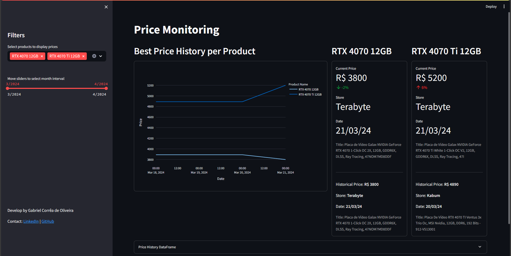
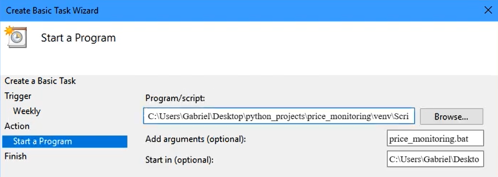

# Price Monitoring

## Description

Project for monitoring product prices through web scraping from various e-commerce sites, with a dashboard for viewing price history.

### Features
- Identification of the lowest available price for cash payment on five e-commerce platforms (Kabum, Amazon, Mercado Livre, Terabyte, and Pichau) for each product
- Web application for viewing price history, with options to filter by product and month interval
- Storage of price and title offer data, date, and store in CSV files separated by product



## Installation

It is necessary to have Python installed, preferably version 3.11 (or newer), in which this project was developed.

Clone the repository into the folder of your choice on computer:

```
git clone https://github.com/Gabriel-c-oliveira/price_monitoring.git
```

Then, with the project's root folder opened in the terminal, install the required libraries using the command:

```
pip install requirements.txt
```

## Usage

Open the file `config/browser.yaml` and define the browser that will be used for data scraping. Chrome and Edge are available options. Also, include your user-agent, which you can easily find by searching "my user-agent" on Google.

```
# browser.yaml - example
browser: 'edge'

user_agent: 'Mozilla/5.0 (Windows NT 10.0; Win64; x64) AppleWebKit/537.36 (KHTML, like Gecko) Chrome/122.0.0.0 Safari/537.36 Edg/122.0.0.0'
```

Insert in the file `config/tracked_products.yaml` the information for each product you want to track: a name for identification, keywords to select only the ads containing them, and URLs resulting from the search for the product on different websites where data collection will take place.

```
# tracked_products.yaml - example
- name: 'RTX 4070 12GB'
  keywords:
    - 'rtx'
    - '4070'
    - '12
  url_kabum: 'https://www.kabum.com.br/hardware/placa-de-video-vga/placa-de-video-nvidia?page_number=1&page_size=20&facet_filters=eyJHZUZvcmNlIFJUWCBTw6lyaWUgNDAiOlsiUlRYIDQwNzAiXX0=&sort=-number_ratings'
  url_mercado_livre: 'https://lista.mercadolivre.com.br/informatica/componentes-pc/placas/placas-video/rtx-4070-12gb_NoIndex_True#D[A:rtx%204070%2012gb,L:undefined,on]'
```

To automate monitoring, a solution using batch files and the Windows Task Scheduler will be presented.

First, modify the paths in the `price_monitoring.bat` file according to the location of the files on your computer. The function of this batch file is precisely to monitor the prices of the products in the URLs inserted in the configuration files.

```
@echo off
"[absolute path to python.exe]" "[absolute path to the project]/price_monitoring/src/main.py"
pause
```

Similarly, adjust the path in the `dashboard.bat` file to open the web application with the price history dashboard.

```
@echo off
streamlit run "[absolute path to the project]/price_monitoring/src/visualization/dashboard_generator.py"
pause
```

After correctly setting up the paths, run the batch files whenever there are changes in the YAML configuration files, verifying success through messages in the terminal and the web application.

Finally, open Task Scheduler and follow these instructions:
1. In the "Actions" tab, click on "Create Basic Task".
2. Choose a name for the task.
3. Select the frequency of the task trigger.
4. Choose "Start a program" as the action.
5. For "Program/script" browse for the `python.exe` file on your computer, for "Add arguments" insert `price_monitoring.bat`, and for "Start in" insert the absolute path to the project. Below is an example:



## Project Architecture

The project architecture can be divided into the following stages:

1. **User-inputs**
    - User sets browser, user-agent, product name, keywords, store search URLs
    - Files: `config/browser.yaml`, `config/monitored_products.yaml`

2. **Web Driver Configer**
    - Check the validity of user-input parameters and create a web driver for the chosen browser
    - Libraries: Selenium
    - Files: `src/data/web_driver_configer.py`
    
3. **Web Scraper**
    - Retrieve all offer data from the sites, utilizing distinct web scraping parameters for each store
    - Libraries: Beautiful Soup
    - Files: `src/data/web_scraper.py`

4. **Store Best Offer Finder**
    - For each store, retrieve the lowest-priced offer with a title that matches the desired product keywords
    - Libraries: Selenium, Beautiful Soup
    - Files: `src/data/store_best_offer_finder.py`, `data/latest_scraped_offers.csv`

5. **Price History Updater**
    - Identify the daily and historical best prices for products, and then update the price history CSV files
    - Libraries: pandas, NumPy, datetime
    - Files: `src/features/price_history_updater.py`, `data/[product_name].csv`
      > If the price of a product in a store varies within the same day, the lowest recorded value is prioritized for saving

6. **Process Price History**
    - Prepare the price history data to be used in the web application
    - Libraries: pandas
    - Files: `src/features/process_price_history.py`

7. **Dashboard Generator**
    - Web application to visualize products price history data
    - Libraries: Streamlit, pandas, datetime, Plotly
    - Files: `src/visualization/dashboard_generator.py`


## Suggestions for Improvements

For suggestions for project improvements, please contact me here on GitHub or on [LinkedIn](https://www.linkedin.com/in/gabriel-correa-de-oliveira/).